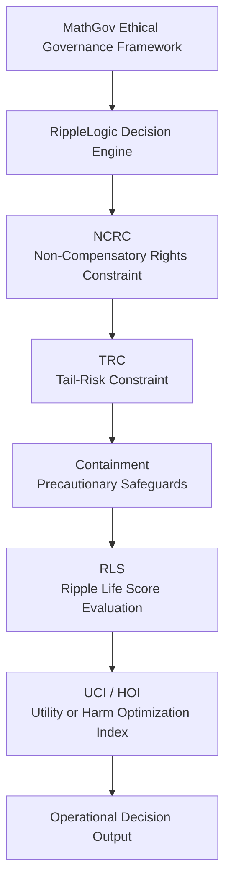

# RippleLogic

Decision Engine of the MathGov Ethical Governance Framework  
A rights-constrained, ripple-aware ethical decision architecture.

RippleLogic provides a structured decision operating system designed to evaluate actions across multiple stakeholders while enforcing non-negotiable rights constraints.

The framework integrates ethical theory, systems thinking, and decision analysis into a transparent architecture suitable for:

• governance analysis  
• AI alignment research  
• policy evaluation  
• complex systems decision-making

---

# System Architecture



---

# Canonical Five-File System

RippleLogic is implemented through a five-document canonical specification set.

1. **Foundation Canon**  
   Core philosophical and structural specification of the MathGov ethical operating system.

2. **Sentience Gradient Protocol (SGP)**  
   Defines ethical weight assignment across different forms of sentience.

3. **ripple.md Standard**  
   Machine-readable schema for encoding RippleLogic decision analysis.

4. **Agent System Specification**  
   Defines how autonomous agents can implement RippleLogic safely.

5. **Ripple Aligners Workbook**  
   Operational Excel framework used for pilot testing and scenario evaluation.

Together these documents form the **complete RippleLogic decision architecture.**

---

# Ethical Decision Cascade

RippleLogic operates through a strict lexicographic cascade.

Each stage must pass before the next stage is evaluated.

```
NCRC → TRC → Containment → RLS → UCI/HOI
```

### Stage 1 — NCRC
Non-Compensatory Rights Constraint

Actions violating fundamental rights are rejected immediately.  
No trade-off or benefit can compensate for a rights violation.

---

### Stage 2 — TRC
Tail-Risk Constraint

Actions with unacceptable catastrophic risk are rejected even if expected value is positive.

---

### Stage 3 — Containment

If risk is uncertain, containment safeguards must be applied before proceeding.

---

### Stage 4 — RLS
Ripple Life Score

Evaluates impacts across stakeholder unions using a structured scoring model.

---

### Stage 5 — UCI / HOI

If multiple options pass all constraints, final selection uses:

• Utility Coordination Index  
• Harm Optimization Index

to choose the best available option.

---

# Intended Use

RippleLogic is designed for evaluation of:

• public policy decisions  
• AI governance problems  
• environmental resource conflicts  
• strategic organizational decisions  
• complex ethical dilemmas

The framework allows decision processes to be:

• transparent  
• auditable  
• structured  
• reproducible

---

# Validation Status

Current validation stage:

**Tier 1 — Conceptual Architecture**  
Formal specification completed.

**Tier 2 — Pilot Testing**  
Operational workbook supports experimental scenarios.

**Tier 3 — Operational Deployment (Future)**  
Requires:

• empirical calibration  
• inter-rater reliability testing  
• standardized UCI instruments  
• institutional implementation trials

---

# Repository Structure

```
.github/
releases/
ripplelogic-proofpack-lite/

Foundation Canon
Sentience Gradient Protocol
ripple.md Standard
Agent System Specification
Ripple Aligners Workbook

README.md
RELEASE_HISTORY.md
RELEASE_POLICY.md
SECURITY.md
CODE_OF_CONDUCT.md
CONTRIBUTING.md
```

---

# Release Status

Latest stable release: **RippleLogic v8.6**

This release provides the first complete specification of the RippleLogic ethical decision operating system.

The framework is architecturally complete and ready for:

• academic peer review  
• open-source inspection  
• Tier 1–2 pilot testing

---

# Relationship to MathGov

RippleLogic is the **decision engine** of the broader MathGov ethical governance framework.

MathGov defines the philosophical and ethical foundations.  
RippleLogic implements the operational decision mechanism.

---

# Citation

If using RippleLogic in research:

```
McGaughran, J. (2026)
RippleLogic: A Rights-Constrained Ripple-Aware Ethical Decision Operating System
MathGov Institute
```

---

# License

This project is released under the repository license.

See `LICENSE` for details.

---

# Author

James McGaughran  
Creator of MathGov and RippleLogic

---

# Project Goal

The long-term objective of RippleLogic is to provide a transparent ethical decision architecture capable of supporting governance systems, autonomous agents, and complex human institutions while protecting fundamental rights and minimizing systemic harm.