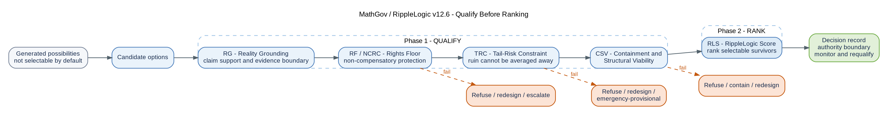

# MathGov Core 2026.09 v12.6 / SGP v8.5

**Exact release identity:** `MathGov_Core_2026_09_v12.6_SGP_v8.5+2026.08.15.3`  
**License:** Apache-2.0 except where a file states otherwise

**Reality -> Rights -> Ripples. Qualify -> Rank.**

MathGov is an open-source, rights-constrained governance framework. Its fixed five-stage cascade is:

`RG -> RF/NCRC -> TRC -> CSV -> RLS`

## What v12.6 improves

v12.6 closes the gap between selecting a qualified option and carrying out a real action. A consequence-bearing action must now remain bound to the option, configuration, transition, post-state, capability state, and qualification snapshot that were actually reviewed. A mismatch blocks execution. Material outcomes or context changes reopen qualification.

The release also strengthens physical-causal warrant boundaries, claim-domain bridges, carried obligations, hidden human compensation checks, source-coupling integrity, and transparent workbook assurance. It adds no sixth gate, no eighth welfare dimension, and no new authority layer.




## Computational Context clarification

For consequential computational systems, the Agent System and ripple.md now expose a compact derived view of the computational problem/object, exact architecture/configuration, demonstrated capability, assigned task, deployment domain, evidence standard, consequence interface, and separate legitimate authority basis. The view does not add a gate or create authority. Its critical rule is: **Consequence interface is not legitimate authority.**

## Canon v12.6 stabilization window

**Public stabilization window: 15 August 2026 through 15 February 2027.** During this period, Canon v12.6 is frozen against speculative feature accretion. Same-line corrections are limited to demonstrated correctness, rights, interpretability, security, citation/release-integrity defects, or material legal/scientific evidence. New constructs and discretionary extensions belong in the roadmap until supported by a clearly superior formally justified design. The primary development emphasis now shifts to independent replay, inter-rater studies, RLS/WDBIP/UCI measurement work, and bounded institutional pilots.

## Start here

- Public introduction: `docs/guides/MATHGOV_3R_1_2_PUBLIC_INTRO_v12_6.md`
- Governing Canon: `docs/canon/RippleLogic_v12.6_Canon.md`
- SGP: `docs/sgp/SGP_v8.5.md`
- Exact Core 15 bundle: `core_15/`
- Component map: `docs/CORE_COMPONENT_MAP.md`
- Current adversarial-audit disposition: `release/MATHGOV_V12_6_CLAUDE_ADVERSARIAL_AUDIT_DISPOSITION_2026_08_11.md`
- Prior change and independence report: `release/MATHGOV_V12_6_AND_MHIOS_V0_7_INDEPENDENT_RELEASE_REPORT.md`
- Final verification: `release/FINAL_VERIFICATION_REPORT.md`
- Source verification log: `release/SOURCE_VERIFICATION_LOG.md`
- Examples and reference replays: `docs/examples/README.md`
- Negative-example catalog: `docs/examples/NEGATIVE_EXAMPLES_INDEX.md`
- Evidence-stage maturity ladder: `docs/assurance/SCIENTIFIC_MATURITY_LADDER.md`
- High-stakes physical/causal worked example: `docs/examples/PC_AEP_HIGH_STAKES_WORKED_EXAMPLE.md`
- Physical execution boundary guide: `docs/guides/PHYSICAL_ADMISSIBILITY_AND_EXECUTION_BOUNDARY.md`
- Safety-conformance vectors: `docs/validation/V12_6_SAFETY_CONFORMANCE_VECTORS.md`

## Core 15 pins

| Component | Version | Governing source |
|---|---:|---|
| RippleLogic Canon | 12.6 | `docs/canon/RippleLogic_v12.6_Canon.md` |
| Sentience Gradient Protocol | 8.5 | `docs/sgp/SGP_v8.5.md` |
| ripple.md Standard | 5.5 | `docs/standards/ripple_md_Standard_v5.5.md` |
| RippleLogic Agent System | 12.5 | `docs/agents/RippleLogic_Agent_System_v12.5.md` |
| CSV Gate Standard | 2.4 | `docs/standards/CSV_Gate_Standard_v2.4.md` |
| RippleLogic Cascade Standard | 2.6 | `docs/standards/RippleLogic_Cascade_Standard_v2.6.md` |
| Reproducibility and Use Standard | 1.4 | `docs/implementation/MATHGOV_REPRODUCIBILITY_AND_USE_STANDARD_v1.4.md` |
| WDBIP | 1.6 | `docs/standards/wdbip/Welfare_Dimension_Boundary_and_Interaction_Protocol_v1.6.md` |
| RLS Validation Protocol | 2.6 | `docs/validation/rls/RippleLogic_RLS_Validation_Protocol_v2_6.md` |
| Foundations Primer | 4.4 | `docs/primer/RippleLogic_Foundations_Primer_v4.4.md` |
| Public Introduction | 12.6 | `docs/guides/MATHGOV_3R_1_2_PUBLIC_INTRO_v12_6.md` |
| PC-AEP | 2.3 | `docs/standards/Physical_Causal_Admissibility_Evidence_Profile_v2.3.md` |
| MFDI Standard | 2.3 | `docs/standards/Methodological_Falsifiability_and_Dependency_Integrity_Standard_v2.3.md` |
| Source-Coupling Integrity Standard | 2.3 | `docs/standards/Source_Coupling_Integrity_Standard_v2.3.md` |
| RippleLogic Aligners Sheet | 5.6 | `docs/aligners/RippleLogic_Aligners_Sheet_v5.6.xlsx` |

## Extended support surfaces

- Run-record schema v4: `schemas/mathgov_run_record_v4.schema.json`
- Run validator: `release/VALIDATE_MATHGOV_RUN.py`
- RLS Validation Workbook v0.3: `docs/validation/rls/RLS_Validation_Workbook_v0_3.xlsx`
- State, transition, and audit-flag registries: `docs/implementation/`
- Machine vectors: `tests/`
- Reproducibility, integrity, and hash checks: `release/`

## Separate MHIOS companion

MHIOS v0.8 is distributed separately as a pre-1.0 candidate human-interface and orchestration companion. It is not a Core 15 governing source and does not add a cascade stage. If MHIOS conflicts with the RippleLogic Canon, the Canon controls.

## Verify

Install the release dependencies from `requirements.txt`, then run:

```bash
python release/VERIFY_RELEASE.py
```

## Claim boundary

Passing the included checks establishes package, schema, formula, rendering, and tested-interface conformance. It does not prove evidence truth, empirical effectiveness, physical safety, legal authority, consciousness, moral truth, framework superiority, or deployment readiness.
