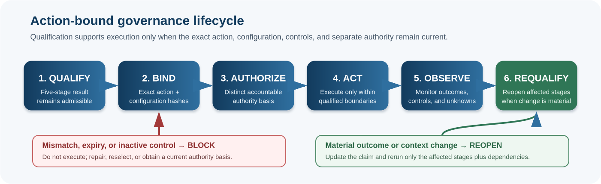

# MathGov Core v12.6 and MHIOS v0.7 Independent Release Report

**Core release:** `MathGov_Core_2026_09_v12.6_SGP_v8.5+2026.08.11.1`  
**MHIOS release:** `MHIOS_v0_7+2026.08.11.1`  
**Publication date:** 10 August 2026  
**Review disposition:** `READY WITH BOUNDED OPEN WORK — CONCEPTUAL FREEZE RECOMMENDED`  
**Construct validity:** `UNTESTED`

## Executive finding

The five-stage MathGov architecture is coherent, necessary in its present separation, and sufficiently specified to freeze conceptually. The audit did not find a justified case for a sixth gate, an eighth scope or dimension, a TRC/CSV merger, weakened rights noncompensation, or a new authority layer.

The original attached builds were not yet freeze-ready because current release surfaces disagreed on citation metadata, build identity, and companion pins; the Canon overstated the meaning of a zero cell; a lock file and malformed text fragment were packaged; MHIOS had two live WDBIP v1.5 crosswalk references; and all governing tables had lost their professional style. These were bounded but genuine defects.

Builds `MathGov_Core_2026_09_v12.6_SGP_v8.5+2026.08.11.1` and `MHIOS_v0_7+2026.08.11.1` preserve those repairs and complete a further reality-grounding crosscheck without changing the governing cascade, formulas, thresholds, rights protections, SGP floors, or semantic versions. The newly supplied external engineering materials did not reveal a missing canonical layer. They did justify one informative consolidation: evidence at derivation, computation, implementation, projection, empirical test, operational qualification, and observed-outcome stages must not be promoted into a stronger later-stage claim. Core is ready for open research release; MHIOS is ready as a candidate implementation companion. Neither is empirically validated or deployment-authorizing.

## 1. Reconstructed architecture

`RG/RSG -> RF/NCRC -> TRC -> CSV -> RLS`

RG is a claim-authority and reality-grounding precondition. RF/NCRC, TRC, and CSV are noncompensatory rejecting gates. RLS is a ranking layer operating only on the selectable set. This is one epistemic precondition, three qualification gates, and one post-qualification ranking stage, not five interchangeable scores.

| Stage | Controlling question | Output boundary |
|---|---|---|
| RG/RSG | Are the material claims adequately grounded for this decision and domain? | Supported, bounded, underdetermined, refused, or learning-action state. |
| RF/NCRC | Does the option preserve the noncompensable rights floor? | Rights-qualified or rejected/redesign/escalation. |
| TRC | Is catastrophic, ruinous, transformative, or irreversible tail exposure acceptable under the declared profile? | Tail-qualified, emergency-provisional, rejected, or refusal under deep uncertainty. |
| CSV | Can the option remain structurally viable under real dependencies, controls, authority, monitoring, and carried obligations? | Selectable, selectable with controls, not material, redesign, escalation, or failure. |
| RLS | Among only selectable options, which has the strongest disclosed 7 × 7 welfare profile? | Ordinal/comparative ranking with uncertainty, distributional, sensitivity, and decisiveness diagnostics. |

The lifecycle continues beyond ranking: selection -> authorization -> exact action binding -> execution readiness -> monitored execution -> outcome observation -> requalification when material conditions change. Qualification is not authority, capability is not authority, authentication is not correctness, and a prior qualification is not a transferable permit.

## 2. Strongest verified features

- Rights and catastrophe protections are structurally non-dilutable by RLS benefit.
- RG exposes evidence domains, warrant domains, uncertainty, unknowns, boundary conditions, and refusal instead of laundering uncertainty through a score.
- TRC and CSV remain distinct: tail exposure is not the same question as structural governability and lifecycle viability.
- RLS cannot run before qualification or resurrect a rejected option.
- SGP separates moral-patienthood/protection, participation, capability, and authority and explicitly rejects consciousness-detector use.
- Exact action/snapshot/configuration binding closes the gap between an abstractly qualified option and the real action executed.
- Machine schemas, negative vectors, workbook surfaces, state registries, and hashes make a substantial portion of the architecture inspectable and replayable.

## 3. Genuine defects repaired

| Defect | Severity | Consequence | Repair |
|---|---:|---|---|
| Stale `CITATION.cff` and mixed earlier build metadata | High | Non-reproducible citation and dependency identity | Exact v12.6 / 10 August metadata, a distinct build 2026.08.11.1 identity, and hard verifier checks. |
| Active component maps and current-line prose contained old companion pins | High | Two valid implementers could choose different governing versions | Synchronized all active source and reading mirrors; added exact mirror checks. |
| MHIOS crosswalks still named WDBIP v1.5 and old MFDI/Source pins | High | False exact-compatibility claim | Corrected to WDBIP v1.6, MFDI v2.3, Source Coupling v2.3 and exact Core build. |
| Zero-cell biconditional was too strong | Medium | Offsetting subgroup/pathway harms could be misread as absence of change | Defined zero as net represented cell change and required non-masking disclosures. |
| Normative coverage counted lines rather than modal clauses | Medium | Misleading coverage denominator and hidden obligations | 154-clause census plus executable-check registry and explicit nonclaims. |
| Generic unstyled tables across governing DOCX files | Medium | Reduced scanability and professional usability | Restored restrained light-blue table system and verified 304 tables across Core and MHIOS. |
| Shipped office lock file | Medium | Dirty-source and tool-conflict risk | Removed and prohibited by verifier. |
| Accidental Canon table fragment | Low | Reader/converter confusion | Removed and synchronized mirrors. |

## 4. Verification outcome

| Surface | Final result |
|---|---:|
| Core current pins, citation, and source hygiene | PASS |
| Core subordinate verification surfaces | 9 / 9 PASS |
| Core run vectors | 6 positive / 29 intended failures |
| SGP RMCP vectors | 1 positive / 1 intended failure |
| WDBIP vectors | 1 positive / 17 intended failures |
| Workbook | 87 sheets / 1,643 formulas / 0 errors after live recalculation |
| Core reading surfaces | 15 triples / 287 tables / 596 pages / 0 confirmed layout defects |
| MHIOS conformance | 4 positive / 52 intended failures |
| MHIOS mutations | 40 / 40 killed |
| MHIOS normative census | 154 clauses; 65 any linkage; 55 direct; 89 unlinked |
| MHIOS document | 17 tables / 66 pages / 0 confirmed layout defects |

## 5. Reality-grounding and evidence-boundary crosscheck

The crosscheck was conducted as an independent requirements audit, not as a derivative design exercise. No external formula, primitive, ontology, taxonomy, verdict system, hardware stack, implementation logic, or proprietary term was imported.

| Methodological challenge tested | Existing MathGov coverage | Build 2026.08.10.2 disposition |
|---|---|---|
| Separate derivation, computation, implementation, projection, measurement, and physical evidence. | MFDI v2.3 milestone claim discipline; PC-AEP v2.3 formal-conformance and specification-to-reality boundary; Scientific Maturity Ladder. | Retained the architecture and added one informative evidence-stage non-substitution matrix. |
| Freeze the evaluation projection before outcome-sensitive observation. | Canon projection pre-registration, parameter/configuration locking, MHIOS projection pre-registration record, independent replay packet. | Already covered; no new field or state added. |
| Allow a failed implementation, prediction, or physical test to propagate upstream. | MFDI dependency-localized failure propagation, non-retrofitting, re-derivation scope, distribution-shift and requalification protocol. | Already covered; verifier now protects the consolidated reporting surface. |
| Distinguish a functioning implementation from domain validity, physical safety, or deployment readiness. | PC-AEP, MFDI, release claim boundaries, scientific maturity levels L0-L6. | Already normative/informative across current sources; made easier to inspect in one matrix. |
| Preserve monitoring, exact action binding, controls, preconditions, outcomes, and requalification at the execution boundary. | MHIOS action/specification/snapshot hashes, execution mandate and authority, readiness conjunction, outcome observation, and requalification. | Already covered; MHIOS report metrics and release verification were synchronized. |
| Keep reality external to the framework and refuse unsupported stronger claims. | RG/RSG, MFDI revision triggers, PC-AEP external evidence, Refusal, and release nonclaims. | Confirmed. Conceptual freeze remains recommended. |

## 6. Changes deliberately rejected

- No sixth gate: no demonstrated failure remained that could not be resolved within RG, RF/NCRC, TRC, CSV, RLS, or the qualification-to-execution lifecycle.
- No TRC/CSV merger: merging would blur non-dilutable catastrophe exposure with control/governability and post-state viability.
- No cardinal moral-utility claim for RLS: the scoring system remains a governed comparative representation, not a measurement of intrinsic worth.
- No weakening of the rights floor or emergency benefit override.
- No universalization of configurable defaults as scientific constants.
- No SGP consciousness detector or capability-to-rights/authority shortcut.
- No AI normative judgment or execution authority.
- No semantic-version bump for corrections that preserve the external contract.

## 7. Remaining bounded open work

Internal coherence is not construct validity. The next program must test inter-rater reliability, parameter calibration, domain transfer, usability and burden, false confidence, institutional capture, legal validity, outcome quality, distribution shift, control effectiveness, and comparative performance against simpler baselines. High-consequence pilots should begin only after low-stakes retrospective replay and a no-AI MHIOS Minimal Vertical Slice establish that the workflow itself adds value.

## 8. Final disposition

**READY WITH BOUNDED OPEN WORK — CONCEPTUAL FREEZE RECOMMENDED.**

The corrected Core should now be frozen at the architectural level. Future changes should require new evidence, a demonstrated failure, or a genuinely new requirement. MHIOS should remain a versioned candidate companion under empirical development rather than being absorbed into Core authority.
